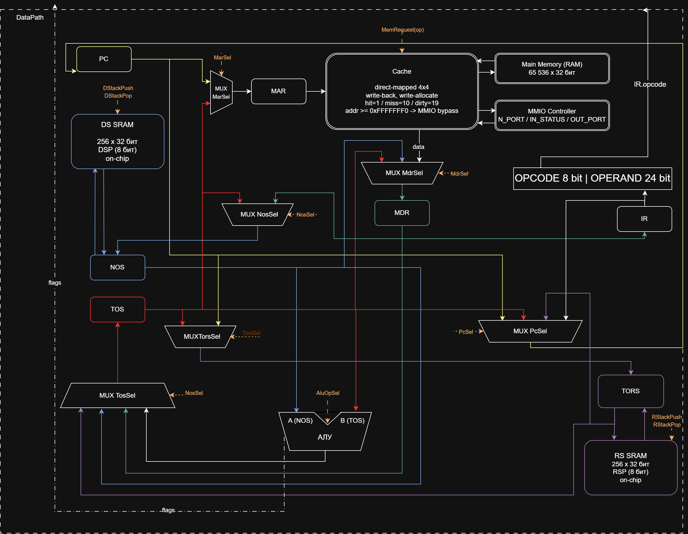
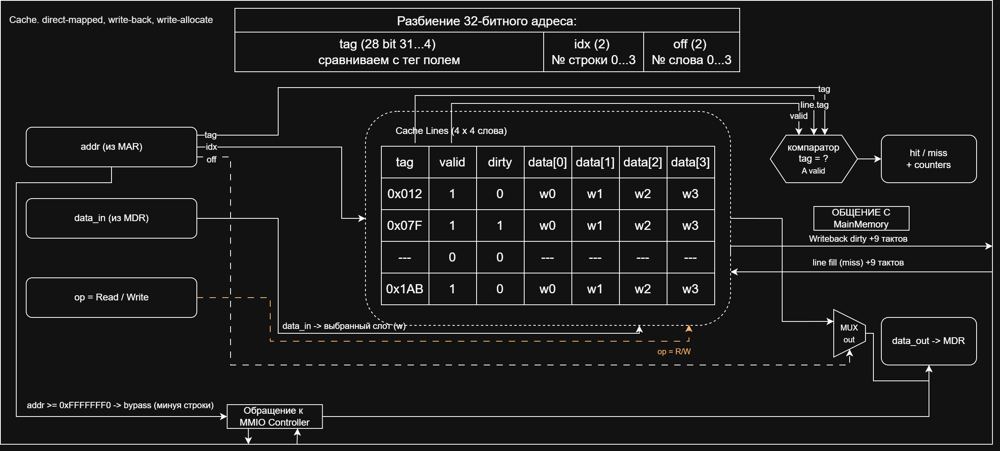
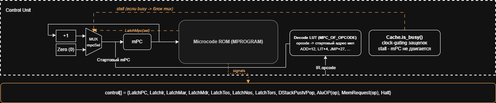
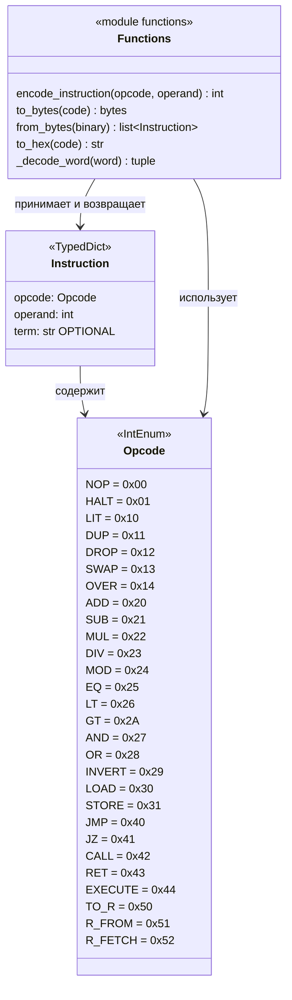
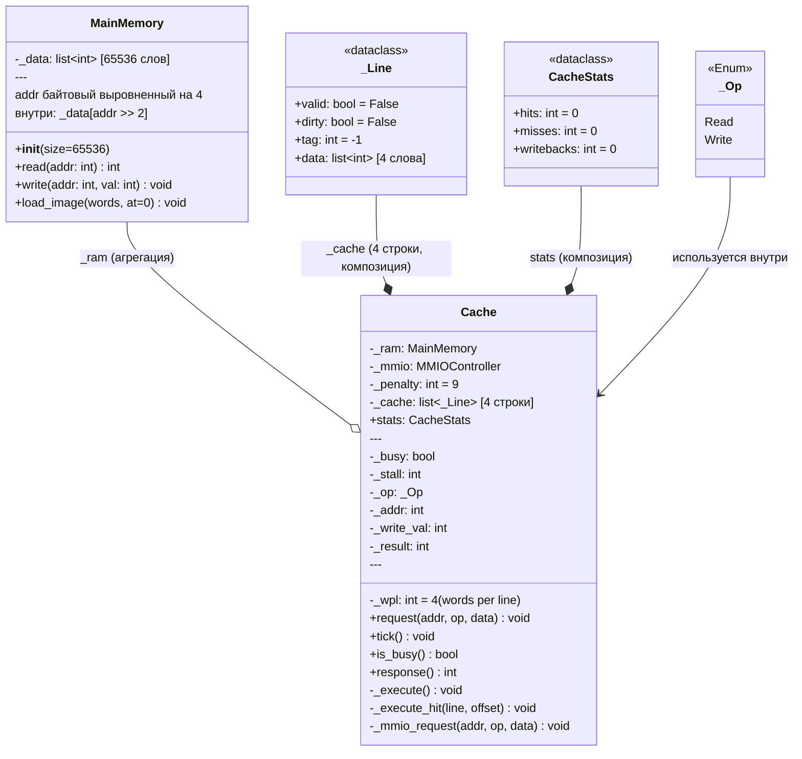
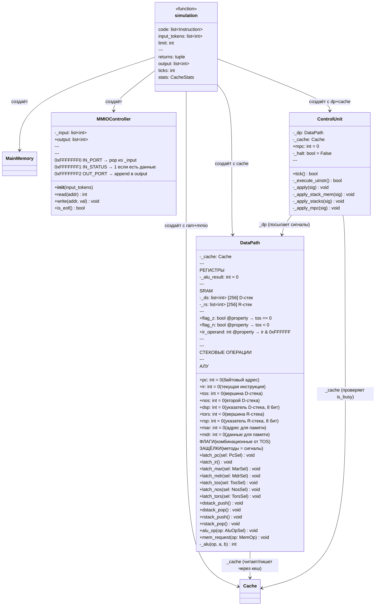

# Forth. Транслятор и модель стековой машины с микрокодом и кешем

<!-- markdown-toc start - Don't edit this section. Run M-x markdown-toc-refresh-toc -->
**Table of Contents**

- [Forth. Транслятор и модель стековой машины с микрокодом и кешем](#forth-транслятор-и-модель-стековой-машины-с-микрокодом-и-кешем)
    - [Язык программирования](#язык-программирования)
    - [Организация памяти](#организация-памяти)
    - [Система команд](#система-команд)
        - [Набор инструкций](#набор-инструкций)
        - [Кодирование инструкций (binary)](#кодирование-инструкций-binary)
    - [Транслятор](#транслятор)
    - [Модель процессора](#модель-процессора)
        - [DataPath](#datapath)
        - [Cache](#cache)
        - [ControlUnit (микрокодированный)](#controlunit-микрокодированный)
        - [Микропрограмма](#микропрограмма)
    - [Тестирование](#тестирование)
        - [Состав тестов](#состав-тестов)
        - [CI](#ci)
        - [Пример использования](#пример-использования)
        - [Демонстрация эффекта кеша](#демонстрация-эффекта-кеша)

<!-- markdown-toc end -->

---

- **ФИО, группа:** *Старченко Александр Николаевич, P3231*
- **Вариант:** `forth | stack | neum | mc | tick | binary | stream | mem | cstr | prob1 | cache`
- Преподаватель: Пенской Александр Владимирович.

Структура проекта подражает референсу [ryukzak/brainfuck](https://github.com/ryukzak/brainfuck) и осознанно следует его принципам: минимум модулей, плоская структура, простота важнее элегантности. Подробный архитектурный документ - [ARCHITECTURE.md](./ARCHITECTURE.md); полная спецификация микрокода - [MICROCODE.md](./MICROCODE.md).

---

## Язык программирования

Подмножество Forth с поддержкой пользовательских процедур и execution token (`'` / `execute`) - особенность варианта.

```ebnf
program     ::= { token } ;
token       ::= number | string_lit | dot_string
              | colon_def | word_use | comment
              | char_lit | tick ;
number      ::= [ "-" ] digit { digit }
              | "0x" hexdigit { hexdigit } ;
string_lit  ::= 'S" '   { char_except_quote } '"' ;
dot_string  ::= '." '   { char_except_quote } '"' ;
colon_def   ::= ":" name { token } ";" ;
word_use    ::= name ;
comment     ::= "(" { char_except_rparen } ")"
              | "\" { char } end_of_line ;
char_lit    ::= "[char]" name ;
tick        ::= "'" name ;    (* push execution token *)
```

Семантика:

- **Стратегия вычислений** - строгая, слева направо. Forth по своей природе eager.
- **Область видимости** - глобальная. Все определения видны после момента объявления.
- **Типизация** - динамическая, фактически бестиповая: всё на стеке - 32-битное знаковое слово, интерпретация зависит от операции.
- **Литералы:**
    - числа компилируются в `LIT` + следующее слово памяти инструкций со значением;
    - строки (`." ..."`, `S" ..."`) размещаются в data-секции как `cstr` (null-terminated, **1 символ = 1 машинное слово = 4 байта** - требование варианта; переход к следующему символу через `cell+`);
    - `." ..."` компилируется в push адреса строки и `CALL` рантайм-функции `print_cstr`.
- **Процедуры:** `: name ... ;` компилируется в кусок кода, заканчивающийся `RET`. Имя слова в словаре связано с адресом первой инструкции - это и есть **execution token (xt)**. `' name` пушит xt на стек, `execute` снимает xt и делает CALL по нему.

Поддерживаемые слова:

| Категория | Слова |
|---|---|
| Стек данных | `dup drop swap over` |
| Стек возвратов | `>r r> r@` |
| Арифметика | `+ - * / mod` |
| Сравнения | `= < > <> 0=` |
| Логика | `and or invert` |
| Память | `@ !` (адрес байтовый) |
| Адресная арифметика | `cells` ( n -> n*4 ), `cell+` ( a -> a+4 ), `chars`, `char+` |
| Управление | `if ... else ... then`, `begin ... until`, `begin ... while ... repeat` |
| I/O (через MMIO) | `key emit cr .` |
| Определения | `: ... ;`, `variable`, `allot`, `constant` |
| Строки | `." text"`, `S" text"`, `[char] X` |
| Execution token | `' word`, `execute` |
| Прочее | `exit` |

## Организация памяти

Фон Нейман: единое 32-битное адресное пространство, **байтовая адресация**. Машинное слово = 32 бита = 4 байта. Адреса инструкций и данных кратны 4 (обычная инструкция занимает 4 байта, `LIT` - 8 байт). MMIO-порты доступны по байтовым адресам `0xFFFFFFF0..F2` (без выравнивания - это порты, у них нет «слова»). Память - однопортовая. Доступ - через **кеш**, на промах +9 тактов.

```text
       Адресное пространство (Neumann, байтовая адресация)
+------------------------------+ 0x00000000
| 0:    JMP main               |  ← стартовый прыжок (байт 0)
| 4..N: тела процедур          |  ← адреса кратны 4 (LIT занимает 8 байт)
|       (включая print_cstr,   |
|        print_num)            |
| ...                          |
| main: ...                    |  ← пользовательский код
|       HALT                   |
+------------------------------+  ← граница выровнена на 4
| data section                 |
|   cstr-строки                |
|   variable-ячейки            |
|   allot-блоки                |
+------------------------------+
| heap (свободно)              |
+------------------------------+ 0xFFFFFFF0
| MMIO region (uncached)       |
|   0xFFFFFFF0  IN_PORT   (R)  |  ← read = pop из input буфера; EOF -> EOFError
|   0xFFFFFFF1  IN_STATUS (R)  |  ← 1 = есть данные, 0 = EOF
|   0xFFFFFFF2  OUT_PORT  (W)  |  ← write = push в output буфер
+------------------------------+ 0xFFFFFFFF
```

**Стеки - на чипе, отдельные SRAM:**

```text
   Data Stack                   Return Stack
+--------------+              +--------------+
| TOS register |              | TORS register|
+--------------+              +--------------+
| NOS register |              | RSP (8 бит)  |
+--------------+              +--------------+
| DS SRAM:     |              | RS SRAM:     |
|   256 слов   |              |   256 слов   |
+--------------+              +--------------+
| DSP (8 бит)  |
+--------------+
```

- `TOS`, `NOS` (data stack) и `TORS` (return stack) - отдельные регистры, чтобы бинарные операции брали два операнда за такт без чтения SRAM стека.
- Стеки **не** размещены в основной памяти. Это сознательное решение: иначе каждая инструкция стоила бы 10+ тактов на cache miss, что убило бы демонстрацию эффекта кеша.

**Размещение данных:**

- **Числовой литерал** -> `LIT` + значение в следующем слове памяти инструкций (вместе 8 байт). Адресация к data-секции не нужна.
- **Строковый литерал** -> размещается в data-секции один раз, в позиции появления. cstr: каждый символ - одно слово (4 байта), терминатор - нулевое слово. Переход к следующему символу - `cell+` (или `4 +`).
- **Переменная (`variable name`)** -> выделяется одно слово (4 байта) в data-секции; имя в словаре превращается в push **байтового** адреса этой ячейки. Чтение - `x @`, запись - `value x !`.
- **Константа (`constant name`)** -> фиксируется на этапе трансляции; в памяти не хранится. Использование компилируется как `LIT <value>`.
- **`allot N`** -> выделяет дополнительные N ячеек (N×4 байта) после предыдущей `variable`, превращая её в массив. Индексация: `arr i cells +` (`cells` умножает индекс на 4).
- **Процедуры** - в код-секции, последняя инструкция - `RET`. Адрес первой инструкции = xt этого слова.
- **Прерывания** - отсутствуют (вариант `stream`, I/O синхронный).

## Система команд

Особенности процессора:

- Стековая машина: операции работают с вершинами data stack (`TOS`, `NOS`).
- Все инструкции - одно машинное слово 32 бита. Исключение - `LIT`, которая занимает **2 слова**: опкод + 32-битное значение.
- Поток управления: инкремент `PC` после каждой инструкции; условный (`JZ`) и безусловный (`JMP`) переходы; вызовы (`CALL` / `RET`); косвенный вызов (`EXECUTE`).
- I/O - memory-mapped, регион MMIO uncached.
- Прерываний нет: ввод/вывод синхронный (вариант `stream`).
- Микрокодированный ControlUnit (вариант `mc`).
- Tick-точная модель (вариант `tick`).

### Набор инструкций

| Mnem | Opcode | Стек до -> после | Описание | Тактов |
|---|---|---|---|---|
| `NOP` | 0x00 | - | пусто | 3 |
| `HALT` | 0x01 | - | остановка модели | 3 |
| **Стек данных** ||||
| `LIT` | 0x10 | -> n | push константы (значение в след. слове) | 4 |
| `DUP` | 0x11 | a -> a a | дубль вершины | 3 |
| `DROP` | 0x12 | a -> | снять | 3 |
| `SWAP` | 0x13 | a b -> b a | обмен двух вершин | 4 |
| `OVER` | 0x14 | a b -> a b a | копия второй сверху | 4 |
| **АЛУ** ||||
| `ADD` `SUB` `MUL` `DIV` `MOD` | 0x20–0x24 | a b -> r | бинарные | 3 |
| `AND` `OR` `INVERT` | 0x27, 0x28, 0x29 | - | побитовые | 3 |
| `EQ` `LT` `GT` | 0x25, 0x26, 0x2A | a b -> flag | сравнения (Forth: -1/0) | 3 |
| **Память (через кеш)** ||||
| `LOAD` (`@`) | 0x30 | addr -> val | чтение из памяти | 4+M |
| `STORE` (`!`) | 0x31 | val addr -> | запись в память | 4+M |
| **Поток управления** ||||
| `JMP a` | 0x40 | - | безусловный переход на адрес `a` | 3 |
| `JZ a` | 0x41 | flag -> | переход если pop == 0 | 3 |
| `CALL a` | 0x42 | - | push PC+1 на RS; PC ← a | 3 |
| `RET` | 0x43 | - | PC ← pop с RS | 3 |
| `EXECUTE` | 0x44 | xt -> | call по адресу с вершины DS | 3 |
| **Стек возвратов** ||||
| `>R` | 0x50 | a -> ⟨RS: a⟩ | переслать с DS на RS | 3 |
| `R>` | 0x51 | ⟨RS: a⟩ -> a | переслать с RS на DS | 3 |
| `R@` | 0x52 | -> a | копия вершины RS на DS | 3 |

\* без учёта cache stall'ов. M = +9 тактов на miss, +9 ещё на write-back грязной строки при вытеснении.

**Классификация:** stack ISA, RISC-стиль (фиксированная длина), Neumann, microcoded ControlUnit.

### Кодирование инструкций (binary)

Бинарное представление - настоящие бинарные файлы (требование варианта); транслятор параллельно пишет отладочный текстовый дамп (`.bin.hex`).

```text
┌─────────┬─────────────────────────────────────────────────────────────┐
│ 31...24 │ 23                                                        0 │
├─────────┼─────────────────────────────────────────────────────────────┤
│  opcode │                  operand (24 бита)                          │
└─────────┴─────────────────────────────────────────────────────────────┘
```

- `opcode` (8 бит) -> 256 возможных опкодов (используется ~30).
- `operand` (24 бита) -> **байтовый** адрес перехода для `JMP`/`JZ`/`CALL` (кратен 4).
- Для инструкций без операнда поле заполняется нулями.
- **Размер:** обычная инструкция занимает 4 байта (одно слово); адреса в дампе байтовые (0, 4, 8, 12, …).
- **Спецслучай `LIT`:** опкод-слово + следующее слово, содержащее 32-битное значение - вместе **8 байт**. При FETCH процессор увидит `LIT` и в микропрограмме `LIT` сам прочитает ещё одно слово; `PC` при этом продвигается на 8 байт (два инкремента по 4).

Типы данных в модуле [isa.py](./isa.py):

- `Opcode` - перечисление опкодов;
- `Instruction` - `TypedDict` с полями `opcode`, `operand`, `term`;
- `encode_instruction`, `to_bytes`, `from_bytes`, `to_hex` - кодирование/декодирование.

Пример дампа (формат `<address> - <HEXCODE> - <mnemonic>`, адреса байтовые):

```text
0  - 40000014 - JMP 20
4  - 10000000 - LIT
8  - 0000002A - <value 42>
12  - 11000000 - DUP
16  - 43000000 - RET
20  - 42000004 - CALL 4
24  - 01000000 - HALT
```

## Транслятор

Интерфейс командной строки:

```text
translator.py <source.fth> <target.bin> [--debug]
```

Реализован в модуле [translator.py](./translator.py).

Этапы трансляции (функция `translate`):

1. **Tokenize.** Разбиение исходника на токены: слова, разделённые whitespace; обработка строковых литералов (`." ..."`, `S" ..."`) и комментариев (`( ... )`, `\ ...`).
2. **Compile (single-pass).** Обход токенов с генерацией машинного кода:
    - число -> emit `LIT` + value слово;
    - встроенное слово -> emit его опкод;
    - имя пользовательского слова -> emit `CALL <addr_of_word>`;
    - `: name` -> начало определения, запоминаем `name -> current_addr` в словаре;
    - `;` -> emit `RET`;
    - `if` -> emit `JZ ?`, push текущий адрес на compile-time stack для backpatch;
    - `else` -> emit `JMP ?`, patch предыдущий `JZ`;
    - `then` -> patch последний адрес из стека;
    - `begin` -> push current_addr;
    - `until` -> emit `JZ <addr_from_stack>`;
    - `while`/`repeat` - стандартный паттерн с backpatch;
    - `variable x` -> выделить слово в data-секции, в словарь `x -> push <addr>`;
    - `allot N` -> выделить N дополнительных слов после последней `variable`;
    - `' word` -> emit `LIT <addr_of_word>`;
    - `." text"` -> разместить строку в data-секции (cstr), emit `LIT <addr>` + `CALL print_cstr`.
3. **Runtime-функции.** В начало кода вставляются процедуры `print_cstr` и `print_num` (десятичный вывод знакового числа). Их адреса используются при компиляции `." ..."` и `.`.
4. **Layout.** Собирается финальный образ: сначала рантайм, затем тела пользовательских процедур, затем `main`, в конце - data-секция.
5. **Emit.** Запись `.bin` (сырых байтов через `struct.pack`) и, при `--debug`, `.bin.hex` (текстовый дамп через `isa.to_hex`).

Backpatching реализуется через placeholder в массиве инструкций - он заменяется, когда становится известен целевой адрес.

## Модель процессора

Интерфейс командной строки:

```text
machine.py <code.bin> <input.txt> [--log]
```

Входные данные:

- файл машинного кода (`.bin`);
- файл ввода в текстовом виде (считывается как последовательность символов).

Выходные данные:

- вывод программы в stdout;
- строка `ticks: N` после завершения симуляции.

Журнал (при `--log`, уровень DEBUG):

- строки `TICK` с `PC`, `mPC`, `TOS`, `NOS` и мнемоникой (на FETCH);
- сообщения о cache hit/miss и записи в `OUT_PORT`.

Реализована в модуле [machine.py](./machine.py).

### DataPath



Реализован в классе `DataPath`. Методы класса соответствуют сигналам микрокода, каждый исполняется за один такт. Корректность последовательности сигналов - ответственность `ControlUnit`.

**Регистры:**

| Регистр  | Ширина  | Назначение                                            |
|----------|---------|-------------------------------------------------------|
| `PC`     | 32      | Program counter                                       |
| `IR`     | 32      | Instruction register                                  |
| `TOS`    | 32      | Top of data stack                                     |
| `NOS`    | 32      | Next on data stack                                    |
| `DSP`    | 8       | Указатель в DS SRAM (next-free слот)                  |
| `TORS`   | 32      | Top of return stack                                   |
| `RSP`    | 8       | Указатель в RS SRAM (next-free слот)                  |
| `MAR`    | 32      | Memory address register                               |
| `MDR`    | 32      | Memory data register                                  |
| `Z`, `N` | 1       | Combinational флаги от TOS                            |

**Сигналы DataPath** (имена соответствуют методам класса):

- `latch_pc(sel)` - обновить PC. Селекторы: `Next` (+1), `Jmp` (IR.operand), `Jz` (Jmp если Z, иначе Next), `FromTors` (RET), `FromTos` (EXECUTE).
- `latch_ir` - IR ← MDR.
- `latch_mar(sel)` - MAR ← PC / TOS.
- `latch_mdr(sel)` - MDR ← кеш / NOS / TOS.
- `latch_tos(sel)` - TOS ← ALU / MDR / NOS / TORS.
- `latch_nos(sel)` - NOS ← TOS / MDR (для SWAP).
- `latch_tors(sel)` - TORS ← PC / TOS.
- `dstack_push` - `DS_SRAM[DSP] ← NOS; DSP++; NOS ← TOS`.
- `dstack_pop` - `DSP--; NOS ← DS_SRAM[DSP]`.
- `rstack_push` / `rstack_pop` - аналогично для RS.
- `alu_op(op)` - выполнить ALU операцию над (NOS, TOS); результат на шине.
- `mem_request(op)` - запрос в кеш (Read / Write).

**Флаги** `Z` и `N` - combinational функции от TOS, не защёлкиваются отдельно. Это упрощает микрокод и снимает класс багов с порядком обновления флагов.

### Cache

Отдельный модуль между ControlUnit и MainMemory, реализован в [cache.py](./cache.py).



**Параметры:**

- **direct-mapped, write-back, write-allocate**;
- **4 строки × 4 слова** (16 слов всего);
- hit = 1 такт, miss = +9 тактов (10 всего), dirty eviction = ещё +9 (19 всего).


**Разбиение адреса (32 бита):**

```text
┌──────────────────────┬───────┬──────┐
│         tag          │ index │offset│
│       28 бит         │ 2 бит │ 2 бит│
└──────────────────────┴───────┴──────┘
```

**MMIO bypass:** адреса `>= 0xFFFFFFF0` идут мимо кеша - кеш-контроллер сразу проксирует запрос в MMIO-контроллер. Это важно: иначе ввод можно было бы «закешировать» и потерять.

**Логирование:** на каждый запрос пишется строка вида:

```text
cache READ  addr=0x00000100 -> HIT  line=0
cache READ  addr=0x00000200 -> MISS line=0 (stall 9)
cache WRITE addr=0x00000300 -> MISS line=0 evict=DIRTY wb=0x00000100 (stall 18)
```

### ControlUnit (микрокодированный)


Реализован в классе `ControlUnit`.

**Принцип работы (один такт):**

1. Если `cache.is_busy()` - ничего не делаем (stall), кеш тикает, return.
2. Иначе: взять `MPROGRAM[mpc]` - это **список сигналов** (одна микроинструкция).
3. Применить все сигналы к DataPath / себе.
4. `LatchMpc` применяется последним - он обновляет mPC.

**Сигналы ControlUnit:**

- `LatchMpc(sel)` - `Zero` (вернуться в FETCH = mPC ← 0), `Next` (mPC+1), `Opcode` (mPC ← `MPC_OF_OPCODE[IR.opcode]`).
- `Halt` - поднять флаг остановки модели.

**Stall кеша невидим для микропрограммы.** Микропрограмма пишется «оптимистично», как будто кеш всегда отвечает за 1 такт. Реальный stall обрабатывается в `ControlUnit.tick()`: если кеш `is_busy()`, mPC **не продвигается** - та же микроинструкция исполнится в следующем такте. Эквивалентно clock-gating в железе.

### Микропрограмма

Микропрограмма - **массив списков сигналов** (стиль OCaml-микрокода из референса). Каждый элемент - одна микроинструкция. Реализована в [microcode.py](./microcode.py).

Структура:

- адреса **0–1**: FETCH (общий для всех инструкций);
- адреса **2+**: тела микропрограмм по опкодам, каждая заканчивается `LatchMpc(Zero)` (возврат к FETCH) или `Halt`.

Карта `opcode -> mPC` - `MPC_OF_OPCODE: dict[Opcode, int]`, заполняется один раз. Всего 35 микроинструкций на 28 опкодов.

Примеры:

```python
# [0] FETCH_1: MAR ← PC; запрос чтения; PC ← PC+1; mPC++
[LatchMar(MarSel.FromPc), MemRequest(MemOp.Read),
 LatchPc(PcSel.Next), LatchMpc(MpcSel.Next)],

# [1] FETCH_2: MDR ← кеш; IR ← MDR; mPC ← декод по опкоду
[LatchMdr(MdrSel.FromMem), LatchIr(), LatchMpc(MpcSel.Opcode)],

# ADD ( a b -- a+b )
[AluOp(AluOpSel.Add), LatchTos(TosSel.FromAlu),
 DStackPop(), LatchMpc(MpcSel.Zero)],

# LIT ( -- n ): чтение следующего слова + push
[LatchMar(MarSel.FromPc), MemRequest(MemOp.Read),
 LatchPc(PcSel.Next), LatchMpc(MpcSel.Next)],
[DStackPush(), LatchMdr(MdrSel.FromMem),
 LatchTos(TosSel.FromMdr), LatchMpc(MpcSel.Zero)],
```

Полная микропрограмма с пояснениями к каждой микроинструкции - в [MICROCODE.md](./MICROCODE.md).

**Особенность реализации варианта (`mc`):** микрокод хранится как данные (список сигналов), а не как код на Python с `if op == "ADD"`. ControlUnit просто исполняет MPROGRAM[mpc] сигнал за сигналом. Это аппаратно-реалистично: каждый сигнал = одна управляющая линия от CU к DataPath.

## Тестирование

Тестирование - **golden tests** на YAML-конфигах + **doctest'ы** в модулях для тонких мест + отдельные **pytest-юниты для кеша и return-стека машины** (где сценарии много-тактовые).

### Состав тестов

Golden-тесты ([`golden_test.py`](./golden_test.py) + `golden/*.yml`):

1. **hello** ([golden/hello.yml](golden/hello.yml)) - печать "Hello, World!".
   Проверяет работу строкового литерала, рантайм-функции print_cstr,
   MMIO вывода через OUT_PORT.

2. **cat** ([golden/cat.yml](golden/cat.yml)) - эхо ввода в вывод
   через бесконечный цикл `begin key emit again`. Проверяет:
   потенциально бесконечный ввод через MMIO IN_PORT, останов по EOFError.

3. **hello_user_name** ([golden/hello_user_name.yml](golden/hello_user_name.yml))
   - интерактивный диалог. Проверяет: variable+allot для буфера,
   чтение строки до `\n`, вывод через emit и print_cstr.

4. **sort** ([golden/sort.yml](golden/sort.yml)) - пузырьковая
   сортировка массива чисел из ввода. Проверяет: variable+allot,
   парсинг чисел через MMIO IN_STATUS, swap/store/load, вывод
   через print_num.

5. **double_precision** ([golden/double_precision.yml](golden/double_precision.yml))
   - вычисление 20! = 2432902008176640000 через 64-битное умножение
   на парах 32-битных слов. Проверяет: арифметику двойной точности
   на 32-битном слове, корректность carry-логики (требование задания).

6. **prob1** ([golden/prob1.yml](golden/prob1.yml)) - Euler problem 4:
   наибольший палиндром-произведение двух трёхзначных чисел = 906609.
   Проверяет: вложенные begin/while/repeat, оптимизацию перебора,
   работу процессора на длительной нагрузке (~6.2M тактов).

7. **execute_demo** ([golden/execute_demo.yml](golden/execute_demo.yml))
   - демонстрация особенности Forth: `'` (push execution token) и
   `execute` (вызов через xt). Проверяет: xt в literals, xt в variable,
   косвенный вызов через инструкцию EXECUTE.

8. **cache_demo** ([golden/cache_demo.yml](golden/cache_demo.yml))
   - два прохода по массиву из 16 слов. Cold pass - все обращения
   MISS, hot pass - все HIT. Демонстрирует требование задания для
   усложнения `cache`: видно, как работает кеш и как процессор
   ожидает данные (stall-такты после MISS).

Каждый golden-тест содержит:

- `in_source` - Forth-исходник;
- `in_stdin` - ввод;
- `in_limit` - лимит тактов (для тяжёлых тестов);
- `out_code_hex` - текстовый дамп бинаря;
- `out_stdout` - ожидаемый вывод;
- `out_log` - адаптированный журнал процессора (логгеры `machine` и `cache`).

Журнал адаптируется под алгоритм через ring-buffer (`CompactLogHandler`):
включаются первые ~80 и последние ~40 записей, длинная середина схлопывается
в строку `... <N log records skipped> ...`. Так даже для `prob1` (~6.2M тактов)
журнал остаётся читаемым и репрезентативным - видны старт, финал с `HALT`,
строки `cache … MISS/HIT` и итоговая `cache: hits=… misses=… writebacks=…`.

**Юнит-тесты кеша** ([test_cache.py](test_cache.py)) - 11 сценариев:

- cold read MISS + повторный HIT;
- заполнение строки кеша (1 MISS + 3 HIT);
- eviction чистой строки (без writeback);
- eviction грязной строки (с writeback);
- write-allocate на MISS;
- write HIT после write-allocate;
- MMIO bypass (не влияет на статистику кеша);
- тайминги: HIT=1 такт, MISS=10 тактов, dirty eviction=19 тактов;
- разбиение адреса (tag/index/offset) - round-trip.

**Юнит-тесты машины** ([test_machine.py](test_machine.py)) - проверка
корректности RStackPop в сценариях CALL->CALL->RET->RET (адреса возврата
восстанавливаются в правильном порядке).

**Doctest'ы** в `isa.py`, `microcode.py`, `cache.py`, `machine.py`:
round-trip кодирования, консистентность микропрограммы, `_split` адреса,
базовые операции DataPath.

Запуск тестов:

```bash
make test
# или
pytest -v
```

Обновление эталонов:

```bash
make test-update-golden
# или
pytest --update-goldens
```

После генерации эталонов через `pytest --update-goldens` запустите
`make normalize-goldens` - он приводит многострочные поля YAML (`in_source`,
`out_log`, …) к читаемому literal-block-стилю (`|`), иначе они сохраняются
одной строкой с `\n`.

### Характеристики реализации алгоритмов

Собрано скриптом [`scripts/measure_algorithms.py`](scripts/measure_algorithms.py)
(`python scripts/measure_algorithms.py`).

| Алгоритм | LoC | Размер кода (байт) | Тактов | Cache: hits / misses / writebacks |
|---|---|---|---|---|
| hello | 1 | 412 | 754 | 145 / 29 / 0 |
| cat | 1 | 352 | 145 | 36 / 3 / 0 |
| hello_user_name | 22 | 844 | 3714 | 506 / 183 / 10 |
| sort | 66 | 1084 | 1228 | 184 / 56 / 0 |
| double_precision | 111 | 3384 | 94131 | 6831 / 5916 / 386 |
| prob1 | 30 | 896 | 6172259 | 555357 / 376512 / 14945 |
| execute_demo | 8 | 528 | 1493 | 236 / 67 / 1 |
| cache_demo | 25 | 864 | 20835 | 1415 / 1331 / 101 |

LoC - непустые строки исходника без строк-комментариев (`\`). Размер кода
в байтах (байтовая адресация: слово = 4 байта, `LIT` = 8 байт) и включает
рантайм-функции (print_cstr, print_num) - поэтому даже минимальные программы
занимают ~350–500 байт.

Замечание про `prob1`: 6.2M тактов - заметная нагрузка для tick-точной
модели; этот тест показывает работоспособность процессора на нетривиальном
алгоритме с глубоко вложенными циклами.

### CI

Конфигурация: [`.github/workflows/ci.yml`](.github/workflows/ci.yml).

На каждый push/PR запускается:

- `ruff format --check` - проверка форматирования;
- `ruff check` - линт;
- `mypy --strict` - статическая типизация;
- `pytest` - все тесты (юнит + doctest + golden).

Конфигурация инструментов в `pyproject.toml`: ruff с большинством правил, mypy strict, line-length=120, max-complexity=7.

### Пример использования

Трансляция:

```bash
$ cat examples/hello.fth
." Hello, World!" cr

$ python translator.py examples/hello.fth hello.bin --debug
$ cat hello.bin.hex | head
0  - 40000140 - JMP 320
4  - 11000000 - DUP
8  - 30000000 - LOAD
12  - 11000000 - DUP
16  - 41000030 - JZ 48
20  - 10000000 - LIT
24  - FFFFFFF2 - <value -14>
28  - 31000000 - STORE
```

Симуляция:

```bash
$ echo "" > empty.txt
$ python machine.py hello.bin empty.txt
Hello, World!
ticks: 754
cache: hits=145 misses=29 writebacks=0
```

С журналом:

```bash
$ python machine.py hello.bin empty.txt --log 2>&1 | head -20
DEBUG   machine:simulation    TICK:   0 PC:   0 mPC: 0 TOS:         0 NOS:         0  JMP
DEBUG   machine:simulation    TICK:   1 PC:   4 mPC: 1 TOS:         0 NOS:         0
DEBUG   machine:simulation    TICK:   2 PC:   4 mPC: 1 TOS:         0 NOS:         0
...
DEBUG   machine:simulation    TICK:  12 PC:   4 mPC:27 TOS:         0 NOS:         0
DEBUG   machine:simulation    TICK:  13 PC: 320 mPC: 0 TOS:         0 NOS:         0  JMP
...
Hello, World!
ticks: 754
cache: hits=145 misses=29 writebacks=0
```

Мнемоника инструкции выводится только в начале каждого FETCH (mPC=0). Stall-такты отображаются пустой мнемоникой - видно, сколько процессор ждёт кеш на каждом промахе.

### Демонстрация эффекта кеша

`cache_demo` делает два прохода по массиву из 16 слов:

```forth
\ Cold pass: первый проход - каждое чтение MISS
0 sum !
0 i !
begin i @ 16 < while
  arr i @ cells + @ sum @ + sum !
  i @ 1 + i !
repeat
sum @ . cr

\ Hot pass: второй проход - все обращения HIT
0 sum !
0 i !
begin i @ 16 < while ... repeat
sum @ . cr
```

Вывод: `136\n136\n` (оба прохода дают одинаковую сумму 1+2+...+16=136), но в журнале видно различие - на cold-проходе для каждой строки кеша возникает MISS со stall'ом 9 тактов, на hot-проходе все обращения HIT.

Также демонстрируется в логе работа MMIO bypass: чтения `0xFFFFFFF0` (IN_PORT) и записи `0xFFFFFFF2` (OUT_PORT) идут мимо кеша и не влияют на статистику hit/miss.


## Дополнительно, для удобства навигации

### Диаграмма классов - isa.py



### Диаграмма классов - microcode.py

```mermaid
classDiagram
    class PcSel {
        <<Enum>>
        Next
        Jmp
        Jz
        FromTors
        FromTos
    }
    class MarSel {
        <<Enum>>
        FromPc
        FromTos
    }
    class MdrSel {
        <<Enum>>
        FromMem
        FromNos
        FromTos
    }
    class TosSel {
        <<Enum>>
        FromAlu
        FromMdr
        FromNos
        FromTors
    }
    class NosSel {
        <<Enum>>
        FromTos
        FromMdr
    }
    class TorsSel {
        <<Enum>>
        FromPc
        FromTos
    }
    class MpcSel {
        <<Enum>>
        Zero
        Next
        Opcode
    }
    class AluOpSel {
        <<Enum>>
        Add Sub Mul Div Mod
        Eq Lt Gt
        And Or Invert
    }
    class MemOp {
        <<Enum>>
        Read
        Write
    }

    class LatchPc {
        <<frozen dataclass>>
        sel: PcSel
    }
    class LatchIr {
        <<frozen dataclass>>
    }
    class LatchMar {
        <<frozen dataclass>>
        sel: MarSel
    }
    class LatchMdr {
        <<frozen dataclass>>
        sel: MdrSel
    }
    class LatchTos {
        <<frozen dataclass>>
        sel: TosSel
    }
    class LatchNos {
        <<frozen dataclass>>
        sel: NosSel
    }
    class LatchTors {
        <<frozen dataclass>>
        sel: TorsSel
    }
    class LatchMpc {
        <<frozen dataclass>>
        sel: MpcSel
    }
    class DStackPush {
        <<frozen dataclass>>
        DS_SRAM[DSP] ← NOS
        DSP++
        NOS ← TOS
    }
    class DStackPop {
        <<frozen dataclass>>
        DSP--
        NOS ← DS_SRAM[DSP]
    }
    class RStackPush {
        <<frozen dataclass>>
        RS_SRAM[RSP] ← TORS
        RSP++
    }
    class RStackPop {
        <<frozen dataclass>>
        RSP--
        TORS ← RS_SRAM[RSP-1]
    }
    class AluOp {
        <<frozen dataclass>>
        op: AluOpSel
    }
    class MemRequest {
        <<frozen dataclass>>
        op: MemOp
    }
    class Halt {
        <<frozen dataclass>>
    }

    class MPROGRAM {
        <<list of lists>>
        list~list~Signal~~
        35 микроинструкций
        индекс = адрес mPC
    }
    class MPC_OF_OPCODE {
        <<dict>>
        Opcode -> int
        ADD->12, LIT->4, JMP->27
    }

    LatchPc --> PcSel
    LatchMar --> MarSel
    LatchMdr --> MdrSel
    LatchTos --> TosSel
    LatchNos --> NosSel
    LatchTors --> TorsSel
    LatchMpc --> MpcSel
    AluOp --> AluOpSel
    MemRequest --> MemOp

    MPROGRAM --> LatchPc : содержит
    MPROGRAM --> LatchIr : содержит
    MPROGRAM --> LatchMar : содержит
    MPROGRAM --> LatchMdr : содержит
    MPROGRAM --> LatchTos : содержит
    MPROGRAM --> LatchNos : содержит
    MPROGRAM --> LatchTors : содержит
    MPROGRAM --> LatchMpc : содержит
    MPROGRAM --> DStackPush : содержит
    MPROGRAM --> DStackPop : содержит
    MPROGRAM --> RStackPush : содержит
    MPROGRAM --> RStackPop : содержит
    MPROGRAM --> AluOp : содержит
    MPROGRAM --> MemRequest : содержит
    MPROGRAM --> Halt : содержит
    MPC_OF_OPCODE --> MPROGRAM : индексирует
```



### Диаграмма классов - cache.py



### Диаграмма классов - machine.py



